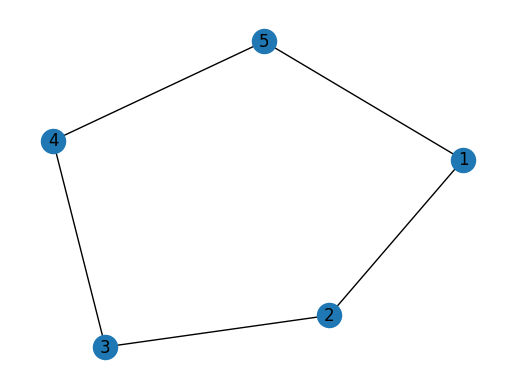
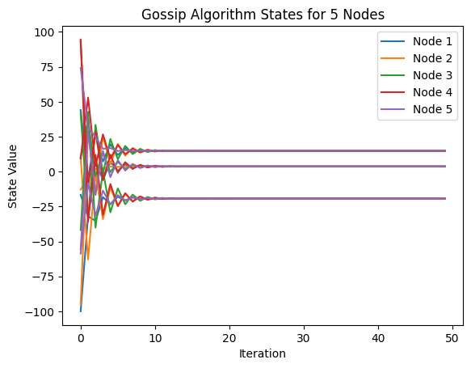

# Topology Link
This Python package `topolink` facilitates the configuration of graph topologies in physical networks using mathematical notation.

## Installation
Install via pip:

```bash
pip install git+https://github.com/rui-huang-opt/topolink.git
```

Or, for development:

```bash
git clone https://github.com/rui-huang-opt/topolink.git
cd topolink
pip install -e .
```

## Undirected Graphs
An **undirected graph** represents pairwise connections between objects without directional constraints. Formally defined as:

`G = (V, E)` where:  
- `V`: Set of vertices/nodes  
- `E`: Set of unordered edges `{u,v}` (connections have no direction)

### Key Properties:
1. **Symmetric Relationships**  
   If `(u,v)` exists, `(v,u)` is the same edge

2. **Neighbor Communication**  
   For any edge `(u, v)` in `E`, nodes `u` and `v` can directly communicate with each other.

### Undirected Graph Example: Ring Topology

#### **Graph Definition**
- `V = {1, 2, 3, 4, 5}`
- `E = {(1, 2), (2, 3), (3, 4), (4, 5), (5, 1)}`

#### **Define and Visualize the Graph**

```python
# On the server (graph coordinator) machine
from topolink import Graph

nodes = ["1", "2", "3", "4", "5"]
edges = [("1", "2"), ("2", "3"), ("3", "4"), ("4", "5"), ("5", "1")]

# Create the graph object
ring = Graph(nodes, edges)

# Visualize the topology
import matplotlib.pyplot as plt

fig, ax = plt.subplots()
ring.draw(ax)
plt.show()
```

#### **Visualization**



## Deploying an Undirected Graph Network

To deploy an undirected graph network using `topolink`, follow these steps:

1. **Define Nodes and Edges**  
   Specify the nodes and their connections as shown in the usage example above.

2. **Initialize the Graph on the Server**  
   On the server machine, create the `Graph` object and start the server with `deploy()`.

3. **Join the Network from Each Node**  
   On each participating machine or process, create a `NodeHandle` object with the node's name and the server address.

> **Note:**  
> The graph server only assists in setting up the network according to the mathematical topology definition.
It does **not** participate in subsequent communication between nodes.

The `NodeHandle` class primarily provides each node (machine or process) with an interface for communication with other nodes.
It also encapsulates common graph operators (such as the Laplacian operator), making it convenient to perform distributed computation and message passing within a network topology.

### NodeHandle Example: Laplacian Consensus

The **consensus algorithm** is widely used in distributed systems to ensure that all nodes gradually reach agreement on their states through local communication. For an undirected graph, the state update of each node can be represented using the Laplacian matrix $L$:

Let $x_i(k)$ denote the state of node $i$ at iteration $k$, and $x(k) = [x_1(k), x_2(k), \dots, x_n(k)]^\top$ be the vector of all node states. The Laplacian matrix $L$ is defined as:

$$
L_{ij} = 
\begin{cases}
\text{deg}(i), & i = j \\
-1, & (i, j) \in E \\
0, & \text{otherwise}
\end{cases}
$$

The consensus iteration formula is:

$$
x(k+1) = x(k) - \alpha L x(k)
$$

where $\alpha > 0$ is the step size parameter. In each iteration, nodes only exchange information with their neighbors. Eventually, all $x_i$ converge to the same value (e.g., the initial average).

#### **Server Side: Define and Launch the Graph**

```python
# On the server (graph coordinator) machine
from topolink import Graph

nodes = ["1", "2", "3", "4", "5"]
edges = [("1", "2"), ("2", "3"), ("3", "4"), ("4", "5"), ("5", "1")]

# Create the graph object
ring = Graph(nodes, edges, address="localhost:5555")

# Start the graph server to coordinate node joining
ring.deploy()
```

```
INFO:topolink.Graph:Server running on 192.168.1.100:5555
INFO:topolink.Graph:Node 1 registered with address 192.168.1.103:39327
INFO:topolink.Graph:Node 2 registered with address 192.168.1.104:42357
INFO:topolink.Graph:Node 3 registered with address 192.168.1.105:45715
INFO:topolink.Graph:Node 4 registered with address 192.168.1.106:34531
INFO:topolink.Graph:Node 5 registered with address 192.168.1.107:41959
INFO:topolink.Graph:All nodes registered. Server is now ready.
INFO:topolink.Graph:Sent neighbor addresses to all nodes.
INFO:topolink.Graph:Node 3 has unregistered.
INFO:topolink.Graph:Node 1 has unregistered.
INFO:topolink.Graph:Node 5 has unregistered.
INFO:topolink.Graph:Node 4 has unregistered.
INFO:topolink.Graph:Node 2 has unregistered.
```

#### **Node Side: Join the Network**

```python
# On each node machine/process
from topolink import NodeHandle

node_name = "1"  # Change this for each node (e.g., "2", "3", ...)
server_address = "<graph-server-ip>:5555"

# Connect to the graph server and join the network
nh = NodeHandle(node_name, server_address)

# Achieve state convergence across all nodes through neighbor communication
import numpy as np

np.random.seed(int(node_name))
state = np.random.uniform(-100.0, 100.0, 3)

alpha = 0.45

print(f"Node {node_name} initial state: {state}")

for k in range(50):
   lap_state = nh.laplacian(state)
   state -= alpha * lap_state

print(f"Node {node_name} final state: {state})
```

```
INFO:topolink.NodeHandle.1:Registered node 1 at 192.168.1.100:5555
INFO:topolink.NodeHandle.1:Neighbor addresses: {'2': '192.168.1.104:42357', '5': '192.168.1.107:41959'}
INFO:topolink.NodeHandle.1:Node address: 192.168.1.103:39327
INFO:topolink.NodeHandle.1:Connected to all neighbors.
Node 1 initial state: [-16.59559906  44.06489869 -99.97712504]
Node 1 final state: [  3.71351278  14.89452413 -19.19659572]
INFO:topolink.NodeHandle.1:Node 1 unregistered from server.
```

```
INFO:topolink.NodeHandle.2:Registered node 2 at 192.168.1.100:5555
INFO:topolink.NodeHandle.2:Neighbor addresses: {'1': '192.168.1.103:39327', '3': '192.168.1.105:45715'}
INFO:topolink.NodeHandle.2:Node address: 192.168.1.104:42357
INFO:topolink.NodeHandle.2:Connected to all neighbors.
Node 2 initial state: [-12.80101957 -94.81475363   9.93249558]
Node 2 final state: [  3.71351278  14.89452413 -19.19659572]
INFO:topolink.NodeHandle.2:Node 2 unregistered from server.
```

```
INFO:topolink.NodeHandle.3:Registered node 3 at 192.168.1.100:5555
INFO:topolink.NodeHandle.3:Neighbor addresses: {'2': '192.168.1.104:42357', '4': '192.168.1.106:34531'}
INFO:topolink.NodeHandle.3:Node address: 192.168.1.105:45715
INFO:topolink.NodeHandle.3:Connected to all neighbors.
Node 3 initial state: [ 10.15958051  41.62956452 -41.81905222]
Node 3 final state: [  3.71351278  14.89452413 -19.19659573]
INFO:topolink.NodeHandle.3:Node 3 unregistered from server.
```

```
INFO:topolink.NodeHandle.4:Registered node 4 at 192.168.1.100:5555
INFO:topolink.NodeHandle.4:Neighbor addresses: {'3': '192.168.1.105:45715', '5': '192.168.1.107:41959'}
INFO:topolink.NodeHandle.4:Node address: 192.168.1.106:34531
INFO:topolink.NodeHandle.4:Connected to all neighbors.
Node 4 initial state: [93.4059678   9.44644984 94.53687199]
Node 4 final state: [  3.71351278  14.89452413 -19.19659572]
INFO:topolink.NodeHandle.4:Node 4 unregistered from server.
```

```
INFO:topolink.NodeHandle.5:Registered node 5 at 192.168.1.100:5555
INFO:topolink.NodeHandle.5:Neighbor addresses: {'4': '192.168.1.106:34531', '1': '192.168.1.103:39327'}
INFO:topolink.NodeHandle.5:Node address: 192.168.1.107:41959
INFO:topolink.NodeHandle.5:Connected to all neighbors.
Node 5 initial state: [-55.60136578  74.14646124 -58.65616893]
Node 5 final state: [  3.71351278  14.89452413 -19.19659573]
INFO:topolink.NodeHandle.5:Node 5 unregistered from server.
```

#### **Results plot**
