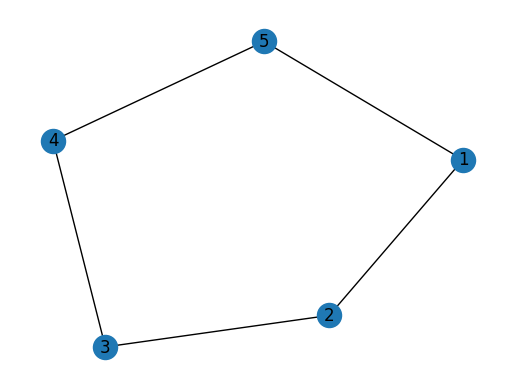
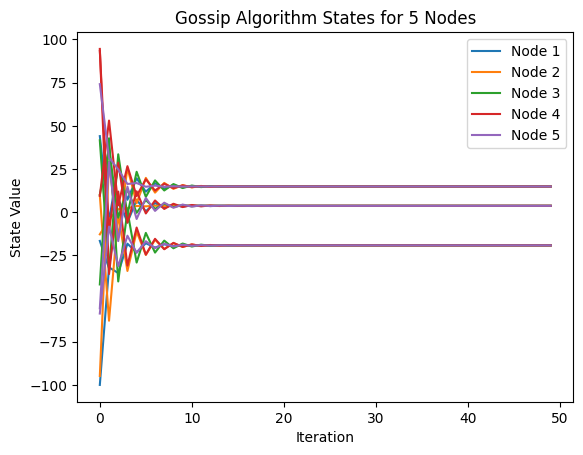

# ConOps (Consensus Operations)
This Python package **conops** provides graph abstractions and synchronous neighbor-to-neighbor communication primitives for distributed consensus and optimization algorithms.

## Installation
Install via pip:

```bash
pip install git+https://github.com/rui-huang-opt/conops.git
```

Or, for development:

```bash
git clone https://github.com/rui-huang-opt/conops.git
cd conops
pip install -e .
```

## Undirected Graphs
An **undirected graph** represents pairwise connections between objects without directional constraints. Formally defined as:

$\mathcal{G} = (\mathcal{V}, \mathcal{E})$ where:  
- $\mathcal{V}$: Set of vertices/nodes  
- $\mathcal{E}$: Set of unordered edges $(u,v)$ (connections have no direction)

### Key Properties
1. **Symmetric Relationships**  
   If $(u,v)$ exists, $(v,u)$ is the same edge

2. **Neighbor Communication**  
   For any edge $(u, v) \in \mathcal{E}$, nodes $u$ and $v$ can directly communicate with each other.

### Undirected Graph Example: Ring Topology

#### Graph Definition
- $\mathcal{V} = {1, 2, 3, 4, 5}$
- $\mathcal{E} = {(1, 2), (2, 3), (3, 4), (4, 5), (5, 1)}$

#### Define and Visualize the Graph

```python
nodes = ["1", "2", "3", "4", "5"]
edges = [("1", "2"), ("2", "3"), ("3", "4"), ("4", "5"), ("5", "1")]

# Create the graph object
import networkx as nx

ring = nx.Graph()
ring.add_nodes_from(nodes)
ring.add_edges_from(edges)

# Visualize the topology
import matplotlib.pyplot as plt

fig, ax = plt.subplots()
nx.draw(ring, ax=ax, with_labels=True)
plt.show()
```

#### Visualization



## Deploying an Undirected Graph Network

To deploy an undirected graph network using `conops`, follow these steps:

1. **Prepare local topology information**  
   Each node should know:
   - its own identifier `node_id`
   - its neighbors as a dictionary `{neighbor_id: weight}`

2. **Initialize the node locally**  
   On each machine or process, create a `Network` with the node's local graph information.

3. **Start distributed communication**  
   Each node communicates directly with its neighbors.

> **Note:**  
> `conops` is fully distributed and does not use a central server.  
> Each node is initialized independently using its own `node_id` and neighbor dictionary.

The `Network` class provides an interface for neighbor communication and common graph operators, such as the Laplacian operator, for distributed computation over the network topology.

### Network Example: Laplacian Consensus

The **consensus algorithm** is widely used in distributed systems to ensure that all nodes gradually reach agreement on their states through local communication. For an undirected graph, the state update of each node can be represented using the Laplacian matrix $L$:

Let $x_i(k)$ denote the state of node $i$ at iteration $k$, and $x(k) = [x_1(k), x_2(k), \dots, x_n(k)]^\top$ be the vector of all node states. The Laplacian matrix $L$ is defined as:

$$
L_{ij} = 
\begin{cases}
\text{deg}(i), & i = j \\
-1, & (i, j) \in E \\
0, & \text{otherwise}
\end{cases}
$$

The consensus iteration formula is:

$$
x(k+1) = x(k) - \alpha L x(k)
$$

In each iteration, nodes only exchange information with their neighbors.
With a suitable step size $\alpha > 0$, all node states converge to a common value. For a connected undirected graph with standard Laplacian consensus, this common value is the average of the initial states.

```python
# On each node machine/process
from conops import Network

node_id = "1"  # Change this for each node (e.g., "2", "3", ...)
neighbors = {"2": 0.45, "5": 0.45} # Change this for each node

# Create the node handle
network = Network(node_id, neighbors)

# Achieve state convergence across all nodes through neighbor communication
import numpy as np
import numpy.random as npr

npr.seed(int(node_id))
x = npr.uniform(-100.0, 100.0, 3)

alpha = 0.45

print(f"Node {node_id} initial state: {x}")

network.start()

try:
   while network.round_id < 50: 
      x = x - alpha * network.laplacian(x)
      network.next_round()

finally:
   network.stop()

print(f"Node {node_id} final state: {x}")
```

#### Results Plot
